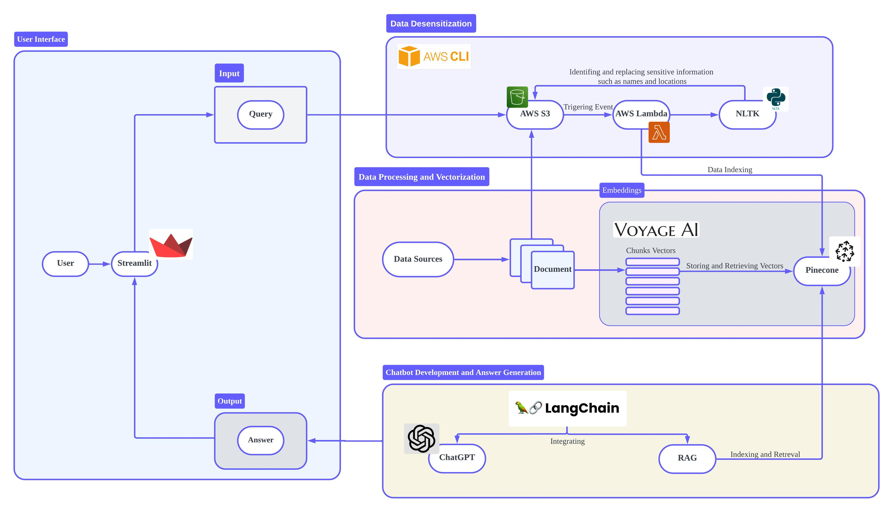

# Title
Better Health at Your Fingertips:  A Revolutionary RAG Chatbot to Boost Patient and Doctor Success.
___
# Introduction
Patient education is essential for enhancing health outcomes, ensuring patient safety, and empowering individuals to make informed decisions about their healthcare. By improving understanding and management of health conditions, patient education helps reduce healthcare costs and increases efficiency in medical services. It promotes better communication between patients and healthcare providers, encourages preventive care, and leads to greater patient satisfaction. Overall, effective patient education is crucial for optimizing both individual health management and the broader healthcare system.

**Here are some current challenges in patient education that the chatbot aims to address:**

**1. Lack of Personalization:** Traditional patient education often follows a one-size-fits-all approach, which can be ineffective due to the diverse backgrounds, education levels, and health literacy of patients. The chatbot aims to provide personalized information tailored to the individual needs and comprehension levels of each patient, enhancing understanding and engagement.

**2. Limited Accessibility:** Patients frequently face challenges accessing timely medical advice, especially outside of regular clinic hours or in remote areas. The chatbot addresses this issue by offering 24/7 accessibility, allowing patients to obtain crucial health information whenever they need it, without geographical or temporal constraints.

**3. Inconsistency in Information Delivery:** The quality and quantity of information patients receive can vary significantly depending on the healthcare provider's workload and the setting. This inconsistency can lead to confusion and non-compliance with medical advice. The chatbot aims to deliver consistent, reliable information that adheres to the latest medical guidelines.

**4. Overwhelming Information Flow:** Patients often feel overwhelmed by the amount of information provided at once, especially after diagnoses or before and after procedures. The chatbot can deliver information in digestible, manageable segments, allowing patients to absorb and revisit the information at their own pace.

**5. Lack of Engagement and Follow-Up:** Engaging patients in their healthcare and ensuring follow-up are crucial for effective management of chronic conditions and recovery processes. The chatbot aims to improve engagement by interacting with patients more frequently and reminding them of important health actions, thereby fostering better adherence to treatment plans.

By addressing these challenges, the chatbot aims to improve the effectiveness of patient education, ultimately leading to better health outcomes and more empowered patients.
___
# Project Goals

- Develop familiarity with various AWS services such as AWS S3, AWS Lambda, and AWS CLI. The goal is to comfortably deploy and manage applications within the AWS environment.

- Construct a fully functional medical Q&A chatbot using the ChatGPT combined with real-world medical datasets. The use of actual data aims to enhance the practicality and accuracy of the model.

- Enhance skills and experience in data handling and the application development of large language models (LLM) through the design, development, deployment, and maintenance of the entire project. This will provide a experience from frontend to backend development, involving data processing, integration with LLM, and deployment on cloud infrastructure.

- Share insights into the healthcare sector. Use this project and its technological implementations as a basis for sparking broader discussions.

# Not a Goal
- The project does not include fine-tuning ChatGPT or any other LLMs. It will utilize pre-trained models accessed directly via APIs.

- There is no plan to host or deploy any open-source large language models. All interactions with models will be conducted through commercial APIs like the ChatGPT API.

- While the project aims to improve abilities in using AWS and implementing LLMs, it is not intended to be expert in AWS or the healthcare industry. The objective is to enhance skills and understanding through practical project implementation, not to achieve expert level status.
___
# Flowchart


[Edit in Lucidchart](https://lucid.app/lucidchart/53d346d3-afd6-4027-a828-cd5e3b341b41/edit?viewport_loc=-6541%2C-3112%2C7163%2C4394%2C0_0&invitationId=inv_50026936-08c6-42e6-b0ca-9e7966f17408)


# Technical Details
## Content
1. Data Security
- Focused on data security by creating a Lambda function for desensitizing text data.
- Implemented Named Entity Recognition (NER) to remove personal names and locations.
- Integrated with AWS S3 for processing and storing data securely.
Technical Details:
Remove names of persons and locations from the given text using NER. Implemented a Lambda function that reads raw text files from an S3 bucket, processes the text to remove sensitive information, and then uploads the cleaned text back to a different S3 bucket. Added error handling to manage unexpected S3 events and processing issues.

2. Downloading and Uploading Data
- Download disease information, drug information, protein sequence and functional information from MedlinePlus, Drugbank, Uniprot and saves the data locally.
- Uploads local files to an S3 bucket.
 Uses requests to fetch the web page and BeautifulSoup to parse the HTML and extract disease name and definition. Creates a filename by sanitizing the disease name and saves the content to a text file. Creates an S3 client using AWS credentials. Uses put_object to upload the file to S3, removing spaces from filenames. Uses os.walk to traverse the directory. Calls upload_to_s3 for each file in the directory.

 3. Data Chunking and Embedding
- Developed a Lambda function for chunking large text files into smaller segments.
- Implemented token counting and chunking to ensure each chunk stays within token limits.
- Developed a function to create embeddings using Voyage AI and store them in Pinecone.
Uses tiktoken to encode the string and count the tokens. Splits text into chunks without exceeding a maximum token limit. Main Lambda handler for processing various file types and chunking data. Uses Voyage AI to create document embeddings. Stores the embeddings and metadata in a Pinecone index.

4. Simple Chatbot
- Built a simple chatbot using OpenAI's GPT model.
- Implemented a session-based chat history storage in AWS S3.
Uses LLMChain to invoke the chat model and get the response. Writes the chat history string to a specified file. Uses upload_file to upload the local file to S3. Interactive chat loop to get user input, generate responses, and save the chat history.

5. Retrieval and Generation
- Developed a system to retrieve relevant documents and generate responses using an LLM.
- Integrated Voyage AI and Pinecone for document embedding and retrieval.
- Implemented functionality to generate pre-signed URLs for accessing documents.
Technical Details:

Create document embeddings using Voyage AI's model. Extracts the bucket name and object key from the S3 URI. Creates an S3 client. Generates a URL with a specified expiration time. Uses the retriever to get relevant documents. Generates pre-signed URLs for each document. Formats the retrieved content and generates a response using the LLM. Sets up the Pinecone API key from environment variables. Specifies the index to use for storing and querying vectors. Uses the specified index name. Utilizes the initialized embeddings for vector storage. Specifies the GPT-4 model. Uses the OpenAI API key from environment variables. Initializes conversation memory using ConversationBufferMemory. Example queries to test the document retrieval and response generation. Formats and displays the generated response as Markdown.

6. Chat-retrieval-chain
- Implemented advanced chatbot functionalities integrating document retrieval, URL generation, and language model generation.
- Utilized LangChain, Voyage AI, and Pinecone to enhance chatbot responses.
Uses dotenv to load environment variables for OpenAI, Voyage AI, and Pinecone API keys. Define a prompt template for retrieval-based question answering. Uses "voyage-large-2" model for embeddings. Initializes Pinecone vector store with the specified index name and embedding function. Defines a system prompt for contextualizing user questions. Uses ChatPromptTemplate to create a prompt that incorporates chat history. Creates a history-aware retriever using the contextualized question prompt. Combine document retrieval and language model generation for answering user questions. Stores chat history for each session using ChatMessageHistory. Uses RunnableWithMessageHistory to ensure chat history is incorporated in each session. Initializes a session ID and S3 client for storing chat history. Runs a loop to handle user inputs, generate responses, and save chat history to S3.

7.  Streamlit Integration
- Developed a patient chatbot with document retrieval and display functionalities using Streamlit, LangChain, Voyage AI, and Pinecone.
- Implemented real-time chat capabilities with pre-signed URL generation for secure access to S3-hosted documents.

Create a web-based user interface for the chatbot. Generate temporary, secure access URLs for S3 objects. Uses the retriever to get relevant documents. Generates pre-signed URLs for the documents. Formats the retrieved content into a user-friendly response using an LLM (Language Model). Save retrieved document content to a file without sensitive information. Replace placeholders in the document content with actual pre-signed URLs. Loads API keys and AWS credentials from Streamlit secrets.Initializes the S3 client using boto3. Uses LangChain to pull a predefined retrieval QA chat prompt. Initializes VoyageAIEmbeddings for embedding documents. Sets up PineconeVectorStore for storing and retrieving embeddings. Defines a system prompt for contextualizing questions. Uses ChatPromptTemplate to create a prompt that includes chat history. Creates a history-aware retriever using the contextualized question prompt. Combine document retrieval and language model generation for answering user questions. Manage chat sessions and maintain chat history across interactions. Displays chat messages from the session state. Handles user input and appends messages to chat history. Generates responses and displays them in the chat interface. Provides a download button for retrieved documents. Includes an "End Conversation" button to save and upload chat history to S3.

##  Tools for building and enhancing the chatbot system.
1. AWS CLI, AWS S3, AWS Lambda
- AWS CLI: Utilized for managing AWS resources, including setting up and configuring AWS S3 buckets and Lambda functions. The CLI commands facilitate interactions with AWS services directly from the command line, allowing for efficient resource management and automation.
- AWS S3: Serves as data storage and backup, storing medical documents, user data, and processed files. S3 buckets are used to hold raw data, intermediate processed data, and final output, ensuring a streamlined data flow.
- AWS Lambda: Processes events triggered by changes in S3, executing data processing tasks such as desensitizing text, chunking large documents, and calling external APIs like Voyage AI for text embedding and Pinecone for data indexing.
2. ChatGPT API, LangChain, RAG
- ChatGPT API: Provides natural language responses to user queries. Integrated through the LangChain framework, ChatGPT handles conversational logic and generates human-like responses.
- LangChain: A framework that integrates ChatGPT API and other components such as RAG. LangChain manages dialogue logic, maintains conversational state, and coordinates interactions between different system components.
- RAG (Retrieval-Augmented Generation): A component of LangChain that enhances ChatGPT's responses by retrieving relevant documents from a knowledge base. RAG improves the accuracy and depth of responses by combining document retrieval with natural language generation.
3. Voyage AI, Pinecone
- Voyage AI: Provides text embedding services, converting textual data into vector representations. These embeddings are essential for efficient document retrieval and similarity search.
- Pinecone: A vector database that stores and retrieves the vectors created by Voyage AI. Pinecone supports fast and scalable vector operations, enabling the retrieval of relevant documents to support RAG in generating accurate and contextually rich responses.
4. NLTK
- NLTK (Natural Language Toolkit): Used for text processing and preprocessing tasks such as tokenization, part-of-speech tagging, and named entity recognition (NER). NLTK aids in preparing text data for subsequent embedding and retrieval steps by cleaning and structuring the input data.
5. Streamlit
- Streamlit: A framework for creating and deploying user interfaces, allowing users to interact with the chatbot. Streamlit provides a responsive front-end where users can input questions, and receive responses, and download relevant documents. It ensures an intuitive and accessible user experience.
## Integrated Process Overview
1. Data Preparation: Use AWS CLI to set up S3 buckets and Lambda functions. Employ NLTK for preprocessing data, including tokenization and named entity recognition, to remove sensitive information. Upload the processed data to S3 for further processing.
2. Data Processing and Vectorization: AWS Lambda listens to S3 events, triggering functions to call Voyage AI for text embedding. The generated vectors are then stored in Pinecone, ready for fast retrieval and indexing.
3. Chatbot Development: Utilize LangChain to integrate ChatGPT API and RAG, creating robust dialogue management logic. RAG leverages vectors stored in Pinecone to perform efficient retrieval tasks, ensuring the chatbot provides high-quality, context-aware responses.
4. User Interface: Develop an interactive interface using Streamlit, where users can submit questions. The system processes these inputs, retrieves relevant information, and provides responses through the integrated ChatGPT API and LangChain framework. The interface also allows users to download detailed documents related to their queries.

1. ChatGPT, LangChain, RAG

- ChatGPT: Used to generate natural language responses, handling user queries.
- LangChain: A framework used to integrate ChatGPT API and other components such as RAG, managing dialogue logic and state.
- RAG: As part of LangChain, utilizes retrieval-augmented generation technology to provide in-depth answers based on documents, enhancing the accuracy of ChatGPT's responses.

3. Voyage AI, Pinecone

- Voyage AI: Provides text embedding services, converting textual data into vector form.
- Pinecone: A vector database used for storing and retrieving vectors created by Voyage AI, supporting LangChain and RAG in generating quick, relevant document-based responses.

4. NLTK

- NLTK (Natural Language Toolkit): Used for text processing and preprocessing, such as tokenization and part-of-speech tagging, aiding the data preparation stage, and preparing for subsequent embedding and retrieval.

5. Streamlit

- Streamlit: Used to create and deploy user interfaces, enabling users to interact with the chatbot. Streamlit provides a clean front-end where users can post questions and receive responses.

6. Integrated Process Overview
- Data Preparation: Use AWS CLI to set up S3 and Lambda. Use NLTK for data preprocessing, then upload to S3.
- Data Processing and Vectorization: Lambda listens to S3 events, calls Voyage AI to process textual data and generate vectors, which are then stored in Pinecone.
- Chatbot Development: Use LangChain to integrate ChatGPT API and RAG, creating dialogue management logic. RAG utilizes vectors in Pinecone to perform retrieval tasks, enhancing response quality.
- User Interface: Create an interface using Streamlit, where users can input questions. The system processes these and provides responses through ChatGPT API and LangChain, with the user interface displaying the results.
  
___
# Timeline


[Suggestion](https://lucid.app/lucidchart/b30b5fc9-1b41-44a5-bad1-e542a0537dbe/edit?invitationId=inv_a4037a07-1f0a-40c8-ba51-7db214845e3c)

___
# Impact and Risks 
1. Utilizing services like AWS, ChatGPT API, and Pinecone might lead to higher operational costs, especially if the usage exceeds the free tiers or initial budget estimates.
- Implement monitoring and alerts for usage across all services. Use AWS Budgets and AWS Cost Explorer to track and forecast expenses. Adjust usage plan on APIs and services or seek additional funding if consistent overages occur.

2. Dependency on external services like AWS Lambda, S3, and third-party APIs means the system's reliability is linked to theirs.
- Use AWS CloudWatch to monitor service health and performance, and set up automated alerts for downtime.

3.  Integrating multiple services (AWS, ChatGPT API, LangChain, Pinecone, etc.) may lead to unexpected technical issues or data flow interruptions.
- Use robust testing and staging environments(?) to test integrations thoroughly before going live. Ensure proper error handling and logging are in place to quickly address integration issues.

4. The AI model might provide incorrect or irrelevant answers, which could misinform users, especially in critical areas like healthcare.
- Implement a robust feedback system(?) to capture inaccuracies and continually train the model with new data. Consider supervision and periodic review of AI responses by medical professionals.

# Appendices and References 
[Retrieval-Augmented Generation for Large Language Models: A Survey](https://arxiv.org/pdf/2312.10997)

# Testing and Validation 
## Manual Testing with a Simulated Event
Purpose: Simulate an S3 event to test the function’s response.
Method: Create a test event JSON and use it to invoke the Lambda function manually.
```json
{
  "Records": [
    {
      "eventVersion": "2.1",
      "eventSource": "aws:s3",
      "awsRegion": "us-east-1",
      "eventTime": "2023-05-01T12:34:56.789Z",
      "eventName": "ObjectCreated:Put",
      "userIdentity": {
        "principalId": "AWSPrincipalID"
      },
      "requestParameters": {
        "sourceIPAddress": "123.123.123.123"
      },
      "responseElements": {
        "x-amz-request-id": "UniqueRequestID",
        "x-amz-id-2": "UniqueID2"
      },
      "s3": {
        "s3SchemaVersion": "1.0",
        "configurationId": "TestConfigRule",
        "bucket": {
          "name": "data-chunking",
          "ownerIdentity": {
            "principalId": "AWSPrincipalID"
          },
          "arn": "arn:aws:s3:::data-chunking"
        },
        "object": {
          "key": "staging/raw/Traumatic amputation_parag_00000_3ed35513.json",
          "size": 1024,
          "eTag": "eTagIdenifier",
          "sequencer": "sequenceNumber"
        }
      }
    }
  ]
}
```


# Revision History
Version 1.1
- Date: 2024/05/20
- Changes:
  1. Create a loop to upload files from local to s3.
   
Version 1.2
- Date: 2024/06/17
- Changes:
  1. Remove spaces from the file name then the Lambda embedding function can be triggered.

Version 1.3
- Date: 2024/06/23
- changes:
  1. Create a loop upload files downloaded from Uniprot
   
Version 1.4
- Date: 2024/06/24
- Changes:
  1. Introduced save_retrieved_docs_to_file to save retrieved documents to a file without sensitive information.
  2. Added custom CSS styles to improve the visual appearance of the Streamlit application, including styles for buttons and text input fields.

Version 1.5
- Date: 2024/06/25
- Changes
  1. Enhanced prompt templates for better user query handling.
  2. Improved initialization of the retriever using PineconeVectorStore with better embeddings handling.
  3. Introduced RunnableWithMessageHistory to manage chat history and session information more effectively.
  4. Enhanced the user interface with additional features such as the ability to download retrieved documents and improved chat message handling.
  5. Set up create_history_aware_retriever for better context-aware question handling.
   


