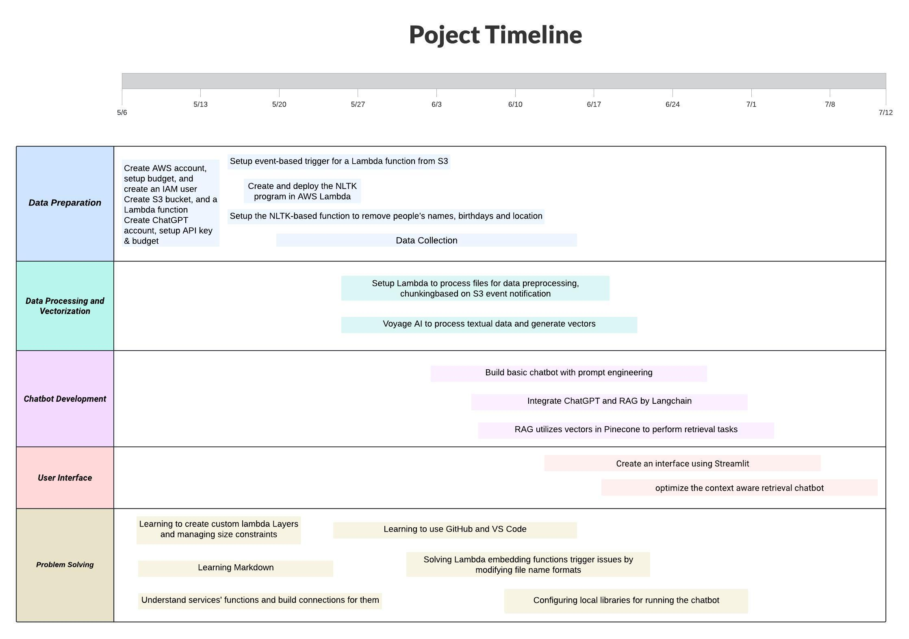

# Title
Better Health at Your Fingertips:  A Revolutionary RAG Chatbot to Boost Patient and Doctor Success.
___
# Introduction
Patient education is essential for enhancing health outcomes, ensuring patient safety, and empowering individuals to make informed decisions about their healthcare. By improving understanding and management of health conditions, patient education helps reduce healthcare costs and increases efficiency in medical services. It promotes better communication between patients and healthcare providers, encourages preventive care, and leads to greater patient satisfaction. Overall, effective patient education is crucial for optimizing both individual health management and the broader healthcare system.

**Here are some current challenges in patient education that the chatbot aims to address:**

**1. Lack of Personalization:** Traditional patient education often follows a one-size-fits-all approach, which can be ineffective due to the diverse backgrounds, education levels, and health literacy of patients. The chatbot aims to provide personalized information tailored to the individual needs and comprehension levels of each patient, enhancing understanding and engagement.

**2. Limited Accessibility:** Patients frequently face challenges accessing timely medical advice, especially outside of regular clinic hours or in remote areas. The chatbot addresses this issue by offering 24/7 accessibility, allowing patients to obtain crucial health information whenever they need it, without geographical or temporal constraints.

**3. Inconsistency in Information Delivery:** The quality and quantity of information patients receive can vary significantly depending on the healthcare provider's workload and the setting. This inconsistency can lead to confusion and non-compliance with medical advice. The chatbot aims to deliver consistent, reliable information that adheres to the latest medical guidelines.

**4. Overwhelming Information Flow:** Patients often feel overwhelmed by the amount of information provided at once, especially after diagnoses or before and after procedures. The chatbot can deliver information in digestible, manageable segments, allowing patients to absorb and revisit the information at their own pace.

**5. Lack of Engagement and Follow-Up:** Engaging patients in their healthcare and ensuring follow-up are crucial for effective management of chronic conditions and recovery processes. The chatbot aims to improve engagement by interacting with patients more frequently and reminding them of important health actions, thereby fostering better adherence to treatment plans.

By addressing these challenges, the chatbot aims to improve the effectiveness of patient education, ultimately leading to better health outcomes and more empowered patients.
___
# Project Goals

- Develop familiarity with various AWS services such as AWS S3, AWS Lambda, and AWS CLI. The goal is to comfortably deploy and manage applications within the AWS environment.

- Construct a fully functional medical Q&A chatbot using the ChatGPT combined with real-world medical datasets. The use of actual data aims to enhance the practicality and accuracy of the model.

- Enhance skills and experience in data handling and the application development of large language models (LLM) through the design, development, deployment, and maintenance of the entire project. This will provide a experience from frontend to backend development, involving data processing, integration with LLM, and deployment on cloud infrastructure.

- Share insights into the healthcare sector. Use this project and its technological implementations as a basis for sparking broader discussions.

# Not a Goal
- The project does not include fine-tuning ChatGPT or any other LLMs. It will utilize pre-trained models accessed directly via APIs.

- There is no plan to host or deploy any open-source large language models. All interactions with models will be conducted through commercial APIs like the ChatGPT API.

- While the project aims to improve abilities in using AWS and implementing LLMs, it is not intended to be expert in AWS or the healthcare industry. The objective is to enhance skills and understanding through practical project implementation, not to achieve expert level status.
___
# Flowchart

[Edit in Lucidchart](https://lucid.app/lucidchart/53d346d3-afd6-4027-a828-cd5e3b341b41/edit?viewport_loc=-6541%2C-3112%2C7163%2C4394%2C0_0&invitationId=inv_50026936-08c6-42e6-b0ca-9e7966f17408)

# Technical Details
1. AWS CLI, AWS S3, AWS Lambda

- AWS CLI: Used for managing AWS resources, such as setting up and configuring AWS S3 buckets and Lambda functions.
- AWS S3: Serves as data storage and backup, storing medical documents, user data, etc.
- AWS Lambda: Processes events triggered from S3, executing data processing, and calling other APIs like Voyage AI for data processing and Pinecone for data indexing.

2. ChatGPT, LangChain, RAG

- ChatGPT: Used to generate natural language responses, handling user queries.
- LangChain: A framework used to integrate ChatGPT API and other components such as RAG, managing dialogue logic and state.
- RAG: As part of LangChain, utilizes retrieval-augmented generation technology to provide in-depth answers based on documents, enhancing the accuracy of ChatGPT's responses.

3. Voyage AI, Pinecone

- Voyage AI: Provides text embedding services, converting textual data into vector form.
- Pinecone: A vector database used for storing and retrieving vectors created by Voyage AI, supporting LangChain and RAG in generating quick, relevant document-based responses.

4. NLTK

- NLTK (Natural Language Toolkit): Used for text processing and preprocessing, such as tokenization and part-of-speech tagging, aiding the data preparation stage, and preparing for subsequent embedding and retrieval.

5. Streamlit

- Streamlit: Used to create and deploy user interfaces, enabling users to interact with the chatbot. Streamlit provides a clean front-end where users can post questions and receive responses.

6. Integrated Process Overview
- Data Preparation: Use AWS CLI to set up S3 and Lambda. Use NLTK for data preprocessing, then upload to S3.
- Data Processing and Vectorization: Lambda listens to S3 events, calls Voyage AI to process textual data and generate vectors, which are then stored in Pinecone.
- Chatbot Development: Use LangChain to integrate ChatGPT API and RAG, creating dialogue management logic. RAG utilizes vectors in Pinecone to perform retrieval tasks, enhancing response quality.
- User Interface: Create an interface using Streamlit, where users can input questions. The system processes these and provides responses through ChatGPT API and LangChain, with the user interface displaying the results.
  
___
# Timeline

[Suggestion](https://lucid.app/lucidchart/b30b5fc9-1b41-44a5-bad1-e542a0537dbe/edit?invitationId=inv_a4037a07-1f0a-40c8-ba51-7db214845e3c)

___
# Impact and Risks 
1. Utilizing services like AWS, ChatGPT API, and Pinecone might lead to higher operational costs, especially if the usage exceeds the free tiers or initial budget estimates.
- Implement monitoring and alerts for usage across all services. Use AWS Budgets and AWS Cost Explorer to track and forecast expenses. Adjust usage plan on APIs and services or seek additional funding if consistent overages occur.

2. Dependency on external services like AWS Lambda, S3, and third-party APIs means the system's reliability is linked to theirs.
- Use AWS CloudWatch to monitor service health and performance, and set up automated alerts for downtime.

3.  Integrating multiple services (AWS, ChatGPT API, LangChain, Pinecone, etc.) may lead to unexpected technical issues or data flow interruptions.
- Use robust testing and staging environments(?) to test integrations thoroughly before going live. Ensure proper error handling and logging are in place to quickly address integration issues.

4. The AI model might provide incorrect or irrelevant answers, which could misinform users, especially in critical areas like healthcare.
- Implement a robust feedback system(?) to capture inaccuracies and continually train the model with new data. Consider supervision and periodic review of AI responses by medical professionals.

# Appendices and References 
[Retrieval-Augmented Generation for Large Language Models: A Survey](https://arxiv.org/pdf/2312.10997)

# Testing and Validation 
# Revision History